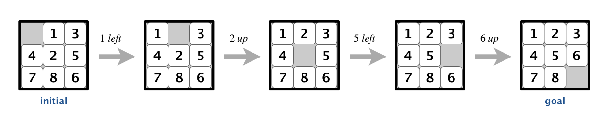
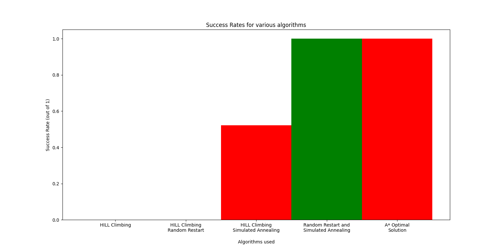
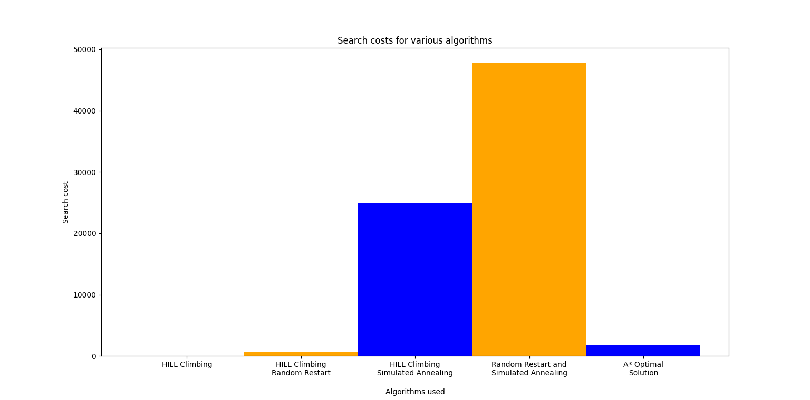
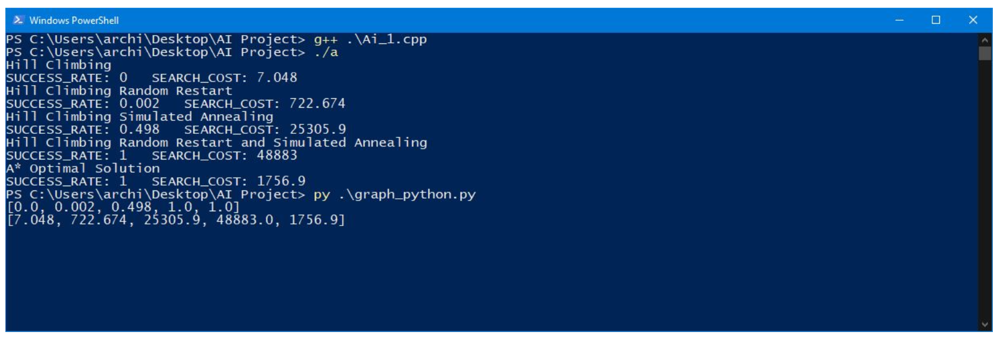

# AI 8-Puzzle Solver

## Requirements:
1. Python version 3.6 or above
2. Python packages: 
   - numpy
   - matplotlib
3. C++ compiler for C++14 and C++17 (preferably GNU Compiler Collection)

## Introduction
N-Puzzle: It is a sliding puzzle that consists of N tiles where N can be 8, 15, 24, and so on. Here N is of the form X^2 - 1. It consists of a grid of X columns and X rows. One of the tiles in the grid is blank and can be used to move the tiles around to solve the puzzle.

This is an 8 puzzle with a given start and goal state. The purpose of the puzzle is to find moves such that the goal state can be found by moving the blank tile.

### Solvability of an n-Puzzle Problem:
Not all states of the n-puzzle problem are solvable. The puzzle instance is solvable based on the following rules:
- If K is odd, then the puzzle instance is solvable if the number of inversions is even in the given state.
- If K is even, the puzzle instance is solvable based on the positions of the blank tile and the number of inversions.
- For all other cases, the puzzle instance is not solvable.

## Methods and Algorithms
1. Heuristic Used:
   - Manhattan Distance: It is calculated by summing the absolute value of the differences in coordinates for the points. In our n-puzzle, the Manhattan distance for a state is calculated as the sum of the Manhattan distance for each tile in the current state and its position in the goal state.

2. Hill Climbing:
   - It is a local search algorithm that uses a greedy approach to find a solution. It evaluates all possible neighboring states and moves to the best one. It terminates when the current state is better than all its neighboring states or when the goal state is found.

3. Random Restart and Simulated Annealing:
   - Random restart involves performing hill climbing for a fixed number of retries and selecting the best ending state among all the retries. Simulated annealing is based on the metallurgical process of annealing, used to pick moves based on a probability function.

4. A* Search:
   - In A* search, an underestimated heuristic is used to evaluate the distance between the tile position and the goal position. The algorithm iterates over possible states until the goal state is found.


## Results



Graphs showing average search cost and success rate for various algorithms after running on 1000 instances of the 8-puzzle problem.



### Observations
- Adjusting the rate of change in temperature in simulated annealing affects the success rate and search cost.
- Combining simulated annealing with restart improves the success rate significantly.
- Basic hill climbing often gets stuck in local maxima.
- A* algorithm consistently reaches the goal state when possible.
- Hill climbing with annealing with random restart has a high success rate and search cost.

## Conclusion
Hill climbing with random restart and simulated annealing shows the best performance among all implemented variations. Basic hill climbing has limitations and often gets stuck. Random restart and simulated annealing provide significant improvements over basic hill climbing.

## References
- [1] https://www.cs.bham.ac.uk/~mdr/teaching/modules04/java2/TilesSolvability.html
- [2] http://www.cs.cmu.edu/afs/cs.cmu.edu/project/learn-43/lib/photoz/.g/web/glossary/anneal.html
- [3] https://www.cs.princeton.edu/courses/archive/spring18/cos226/assignments/8puzzle/index.html
- [4] https://www.cs.ucdavis.edu/~vemuri/classes/aiclass_old/heuristicsearch.pdf
```